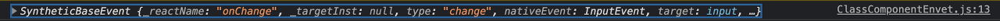

# 2주차 React 스터디 정리

| 장   | 제목          |
| ---- | ------------- |
| 4장 | 이벤트 핸들링 |
| 5장 | ref: DOM에 이름 달기 |

## 4장

### 4.1 리액트의 이벤트 시스템

리액트의 이벤트 시스템은 웹 브라우저의 HTML 이벤트 인터페이스와 동일하기 때문에  
사용법이 비슷하다. 하지만 다음과 같은 차이점이 존재한다.  
1. 이벤트 이름은 카멜표기법으로 표기한다
2. 이벤트에 실행할 js코드를 전달하는 것이 아닌 함수 형태의 값을 전달한다.
3. DOM요소에만 이벤트를 설정할 수 있다
    + 직접만든 컴포넌트에서는 이벤트를 체적으로 설정할 수 없다. 만약 직접  
      만든 컴포넌트에 onClick={sth}이라는 클릭 이벤트를 설정한다면 이는  
      이름이 onClick인 props가 된다. 하지만 전달 받은 props를 컴포넌트  
      내부에 DOM이벤트로 설정할 수는 있다.  
      
4. 이벤트에서 false를 반환하더라도 이벤트 버블링을 방지할 수 없다. 따라서  
반드시 preventDefault()를 사용해야 한다.
   
5. 리액트의 이벤트 핸들러는 모든 브라우저에서 이벤트를 동일하게 처리하기 위해  
이벤트 레퍼인 SyntheticEvent 객체를 전달한다. 만약 브라우저 고유의 인터페이스  
   가 필요하다면 nativeEvent attribute를 사용하면 된다

### 4.2 예제로 이벤트 핸들링 익히기

```jsx
import React, {Component} from 'react';
 
class ClassComponentEnvet extends Component {
    render() {
        return (
            <div>
                <h1>practice event</h1>
                <input type="text"
                       name="message"
                       placeholder="input anything"
                       onChange={
                           (e) => {
                               console.log(e);
                           }
                       }
                />
            </div>
        )
    }
}
 
export default ClassComponentEnvet;

```
위 코드를 실행하면 다음과 같은 결과가 나온다.
  
이때 출력되는 이벤트 객체는 위에서 언급한 웹브라우저의 네이티브 이벤트를 감싸는  
SyntheticEvent이다. 이 객체는 네이티브 이벤트와 같은 인터페이스를 사용하므로  
바닐라로 HTML 이벤트를 다룰때와 똑같이 사용하면 된다. 
#### e.persist()
합성이벤트는 v16까지 구형 브라우저에서의 퍼포먼스 향상을 위해 object pooling  
방식을 사용했다. 하지만 모던 브라우저에서 object pooling을 사용한 퍼포먼스 향상  
을 기대할 수 없다는 판단 하게 이 방식을 더이상 사용하지 않게 되었다. 그 떄문에 v16  
까지는 이벤트가 끝나면 이벤트가 초기화 되었고 비동기적으로 이벤트 객체를 참조해야  
했다면 e.persist()메서드를 호출해야 되었다. 하지만 object pooling을 사용  
하지 않는 현재 시점에서는 더이상 그럴 필요가 없다. e.persist()는 남아 있지만  
더이상 아무런 기능도 하지 않는다. 
## 5장

### 5.1 ref는 어떤 상황에서 사용해야 할까?
통상적으로 리엑트에서 props는 부모 컴포넌트가 자식과 상호작용할 수 있는 유일한  
수단이다. 자식을 수정하기 위해서는 props를 전달해 자식을 리렌더링 해야 한다.  
하지만 간혹가다 자식을 직접적으로 수정해야 하는 경우가 발생하는데 이때 사용하는 것이  
ref이다.  
#### id와 ref
HTML에서 통상적으로 DOM에 이름을 달때는 id를 사용한다. 하지만 id는 고유해야  
하며 전역적으로 작동하기 때문에 이로 인한 id 중복 문제가 발생할 수 있다. 하지만  
ref는 해당 컴포넌트에서만 작동하기 때문에 이 문제를 해결할 수 있다.
#### ref를 사용해야 될 때
1. 포커스, 텍스트 선택영역, 미디어 재생을 관리할 때
   +ref를 사용하면 DOM API와 상호작용할 수 있다.
2. 애니메이션을 직접적으로 실행할 때
   +애니메이션을 직접 실행시키기 위해서는 해당 DOM 노드에 직접 접근을 해야 한다. 
3. 서드파티 DOM 라이브러리를 REACT와 같이 사용할 때
   +일부 라이브러리들은 DOM에 강하게 의존하고 있다. 
   
#### ref를 최대한 적게 사용해야 하는 이유
1. It breaks encapsulation  
리액트는 오직 props를 통해 컴폰넌트 간의 커뮤니케이션을 할것을 요구하고 있다. ref는  
   원하는 정보를 원하는 곳까지 전달하기는 하지만 ref가 데이터 동기화를 검증하지 않기  
   떄문에 data-driven action을 잃게 된다. 따라서 state는 업데이트 되지 않고  
   컴포넌트는 리렌더링 되지 않는다. DOM에 대한 변화 역시 애플리케이션 상태에 반영되지  
   않는다.
   
2. It doesn't follow the React pattern  
[Thinking in React](https://reactjs.org/docs/thinking-in-react.html)  
   위 글에서 개발자는 애플리케이션의 모든 UI 조각을 state와 컴포넌트 계층 구조로 관리한다  
   나와있다. ref를 사용해 데이터를 전달하는 것은 리액트 사고 패턴에 위배된다. 디자인에서의  
   리액트는 state-driven이다. 즉, 각 컴포넌트는 상태보존적이여야 한다. 컴포넌트는 서로  
   다른 상태들이 있고 그 상태들을 바꾸어서 UI의 생김새를 바꿀 수 있다.  
   
3. It encourages event-driven development  
리액튼느 data-driven으로 설계되었다. ref는 애플리케이션의 UI 업데이트를 데이터의 변함에  
   따라 업데이트 하는 것이 아닌 이벤트를 기반으로 업데이트 하는 것을 장려한다. ref를 사용  
   하면 이벤트가 발생 했을 때 UI가 업데이트 된다. 그러나, 리액트는 모든 컴포넌트가 상태  
   보전적이며 상태를 수정해 UI를 바꿀 수 있는 state-driven을 선호한다.
   
4. Tends to override React provided APIs  
리액트는 조건부 렌더링 같은 일부 기능들을 위해 API를 제공한다. ref를 사용하는 것은 리액트  
   애플리케이션에 대한 사고 방식을 바꾸며 이런 natvie API들을 간과하게 한다. 이러한 기능들은  
   온전히 리액트 API로 구현 가능하므로 native DOM element들을 사용하지 않아야 한다. 오직  
   순수 리액트 만으로 하지 못한는 것들만 ref를 사용해야 한다.
   
[출처: Why you should use refs sparingly in production](https://blog.logrocket.com/why-you-should-use-refs-sparingly-in-production/)


### 5.2 ref 사용


### 5.3 컴포넌트에 ref 달기

[5.2, 5.3](https://iskull-dev.tistory.com/144?category=947081)

------

질문, 이해가 안 갔던 것, 궁금한 것, 스터디장이나 다른 사람들에게 물어보고 싶은 것, 기타 등등이 있으시면 써주시고, 이 문구는 지워주세요!
