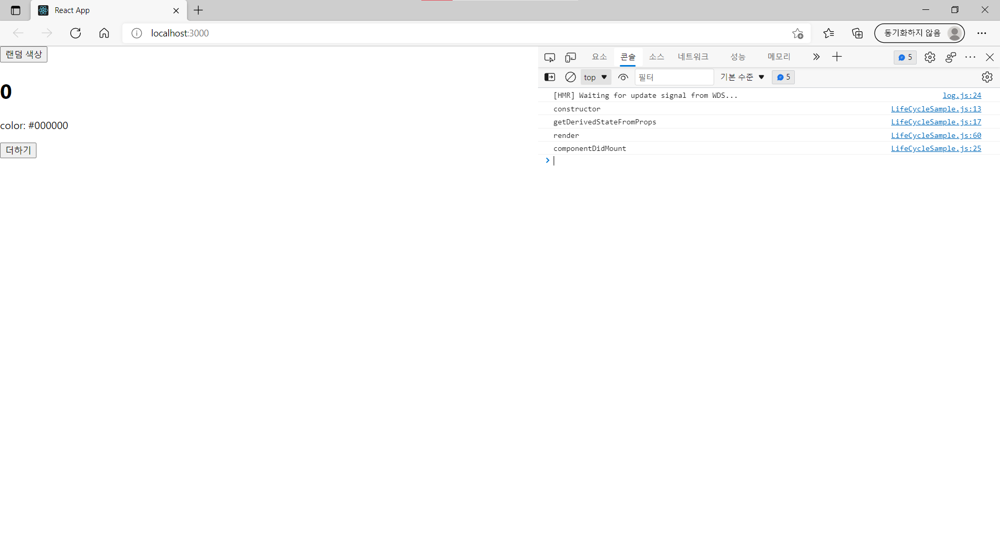
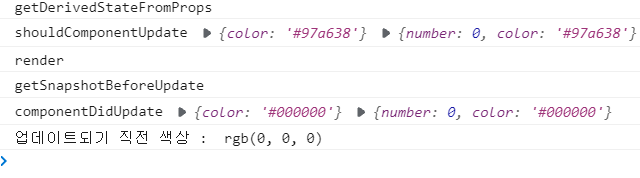

# 3주차 React 스터디 정리

| 장  | 제목                           |
| --- | ------------------------------ |
| 6장 | 컴포넌트 반복                  |
| 7장 | 컴포넌트와 라이프사이클 메서드 |
| 8장 | Hooks                          |

## 6장

💡**map이란 ?** 반복되는 컴포넌트를 사용해야 할 때 유용한 함수. 파라미터로 전달된 함수를 사용하여 새로운 배열을 생성한다.

<br />

### 6.1 자바스크립트 배열의 map() 함수

<**map 함수 문법**>  
**arr.map(callback, [thisArg])**

-   callback : 새로운 배열의 요소를 생성하는 함수. 3가지의 파라미터를 가진다.

    -   currentValue : 현재 처리하고 있는 요소
    -   index : 현재 처리하고 있는 요소의 index 값
    -   array : 현재 처리하고 있는 원본 배열

-   thisArg(선택항목) : callback 함수 내부에서 사용할 this 레퍼런스

<예제>

```jsx
var number = [1, 2, 3, 4, 5];

var processed = number.map(function (map) {
    return num * num;
});

console.log(processed);
```

위 예제 코드를 ES6 문법으로 간략하게 바꿀 수 있다.

```jsx
var number = [1, 2, 3, 4, 5];

var processed = number.map((num) => num * num);

console.log(processed);
```

실행결과는 아래와 같이 동일하며 number 배열을 이용한 새로운 배열이 나온 것을 볼 수 있다.


<br />

### 6.2 데이터 배열을 컴포넌트 배열로 변환하기

문자열로 이루어진 데이터배열로, li를 연속으로 사용해야 하는 경우의 예제를 만들어 볼 것이다.

```jsx
import React from "react";

const IterationSample = () => {
    const names = ["김밥", "떡볶이", "튀김", "어묵"];
    const nameList = names.map((name) => <li>{name}</li>);
    return <ul>{nameList}</ul>;
};

export default IteractionSample;
```

위 예제를 만들어보면, names에 선언한 문자열데이터들이 순서대로 잘 나오는 것을 볼 수 있다.  
그러나 웹페이지상으로는 문제 없이 보이지만, 개발자도구에 들어가면 <font color='red'>Warning 문구</font>가 떠있다.  
key prop이 존재하지 않는다는 경고문이고, 왜 key가 있어야 하는지 다음 절에서 알아볼 것이다.

<br />

### 6.3 key

**리액트에서의 key** : 컴포넌트 배열을 렌더링했을 때 어떤 원소에 변동이 있었는지 알아내려고 사용한다.

<br />

key가 없어도 _Virtual DOM_ 을 이용해 변화를 감지할 수 있으나,  
**key를 지정하는 것**이 변화를 알아내는 데에 더 빠른 도움이 된다.

key를 설정하는 데 유의해야할 점은 **`key값이 언제나 유일해야 한다는 점`**이다.  
그래서 데이터가 가진 고유한 값을 key값으로 설정한다.

이전에 만든 분식예제에 key값을 추가하게 되면,

```jsx
import React from "react";

const IteractionSample = () => {
    const names = ["김밥", "떡볶이", "튀김", "어묵"];
    const nameList = names.map((name, index) => <li key={index}>{name}</li>);
    return <ul>{nameList}</ul>;
};

export default IteractionSample;
```

개발자도구에 들어갔을 때, Warning 경고창이 사라진 것을 볼 수 있다.  
이때는 콜백함수의 인수인 index를 사용했으나 index는 고유한 값이 없을 때만 사용해야 한다.  
<mark style='background-color: #dcffe4'> -> index를 키로 사용하면 효율적으로 리렌더링하지 못하기 때문 ! </mark>

<br />

### 6.4 응용

지금까지는 우리가 미리 설정해놓은 정적인 배열을 사용했다면, 응용으로 동적인 배열을 사용할 것이다.

Input 창에 원하는 문자열을 입력하면, 리스트에 추가되어 추가된 문자열도 웹페이지 리스트에 보이도록 만들려고 한다.

```jsx
import React, { useState } from "react";

const IteractionSample = () => {
    const [names, setNames] = useState([
        { id: 1, text: "김밥" },
        { id: 2, text: "떡볶이" },
        { id: 3, text: "튀김" },
        { id: 4, text: "어묵" },
    ]);

    const [inputText, setInputText] = useState("");
    const [nextId, setNextId] = useState(5); //useState 안 숫자는 상태초기값. 현재 id는 4까지, 5부터 시작하기 위해 넣음.

    const onChange = (e) => setInputText(e.target.value);
    //추가버튼 클릭 시 onClick이벤트
    const onClick = () => {
        const nextNames = names.concat({
            id: nextId, //nextId를 id값으로 설정.
            text: inputText,
        });
        setNextId(nextId + 1); //다음에 입력할 text의 id값을 위해 +1 해줌.
        setNames(nextNames); // names 업데이트하기
        setInputText(""); //inputText 비우기
    };

    const namesList = names.map((name) => <li key={name.id}>{name.text}</li>);
    return (
        <div>
            <input value={inputText} onChange={onChange} />
            <button onClick={onClick}>추가</button>
            <ul>{namesList}</ul>
        </div>
    );
};

export default IteractionSample;
```


**-push와 concat의 차이점-**  
push : 기존 배열 자체를 변경  
concat : 기존 배열을 두고, 새로운 배열을 만듬

`리액트에서 상태를 업데이트 할 땐, 기존 상태를 그대로 두고 새로운 값을 상태로 설정해야 한다.`

이를 **불변성 유지**라고 하며, 불변성 유지가 필요한 이유는 ?  
-> 후에 리액트 컴포넌트의 성능을 최적화 할 수 있다 !

추가를 했다면, 추가한 요소를 삭제하는 법도 필요하다.

DoubleCilck 이벤트를 이용하여 문자열을 삭제해보려고 한다.  
이때 사용할 함수는 filter 함수인데, 특정 조건에 해당하는 원소만 남길 수 있다.  
더블클릭 시, onRemove가 활성화되어 선택한 id와 같지 않은 원소들만 남겨 nextNames에 넣으라는 의미이다.

```jsx
const onRemove = (id) => {
    const nextNames = names.filter((name) => name.id !== id);
    setNames(nextNames);
};

const namesList = names.map((name) => (
    <li key={name.id} onDoubleClick={() => onRemove(name.id)}>
        {name.text}
    </li>
));
```

위 코드를 추가하여 실행해보면, 더블클릭 시 원하는 문자열을 지울 수 있다.

<br />

### 6.5 정리

<**기억할 점**>

1. **key값 설정 주의하기**
2. **배열 변경 시, 새로운 배열 만들고 새로운 상태로 설정하기**

<br />

## 7장

💡**컴포넌트 라이프사이클이란 ?** 페이지에 렌더링되기 전 준비 과정부터 페이지에서 사라질 때 끝난다.  
라이프사이클 메서드는 _클래스형 컴포넌트_ 에서만 사용할 수 있으며, 함수형에서는 _Hooks_ 를 이용해 비슷하게 처리할 수 있다 !

<br />

### 7.1 라이프사이클 메서드의 이해

라이프사이클 메서드의 종류는 9가지이며, 3가지의 카테고리로 나뉜다.

1. 마운트
2. 업데이트
3. 언마운트

**마운트란 ?** DOM이 생성되고 웹 브라우저상에 나타나는 것.  
`마운트할 때 호출하는 메서드`  
constructor -> getDerivedStateFromProps -> render -> componentDidMount

-   contructor : 컴포넌트를 새로 만들 때마다 호출되는 클래스 생성자
-   getDerivedStateFromProps : props에 있는 값을 state에 넣을 때 사용
-   render : 우리가 준비한 UI를 렌더링
-   componentDidMount : 컴포넌트가 웹 브라우저상에 나타난 후 호출

그리고 컴포넌트는 총 4가지 경우에 업데이트 된다.

1. props가 바뀔 때
2. state가 바뀔 때
3. 부모 컴포넌트가 리렌더링 될 때
4. this.forceUpdate로 강제로 렌더링을 트리거 할 때

`업데이트할 때 호출하는 메서드`  
getDerivedStateFromProps -> shouldComponentUpdate -> render -> getSnapshotBeforeUpdate -> componentDidUpdate

-   getDerivedStateFromProps : 마운트에서도 호출되고, 업데이트 시작 전에도 호출된다.
-   shouldComponentUpdate : 컴포넌트가 리렌더링을 해야 할지 말아야 할지를 결정함. Boolean 값을 반환하며 false가 반환될 시 컴포넌트가 리렌더링되지 않는다. 그러나 특정 함수에서 this.forceUpdate() 함수를 호출하면 이 과정을 생략하고 바로 render로 넘어감.
-   getSnapshotBeforeUpdate : 컴포넌트 변화를 DOM에 반영하기 바로 직전에 호출
-   componentDidUpdate : 컴포넌트 업데이트 작업이 끝난 후 호출

**언마운트란 ?** 마운트의 반대 과정으로, 컴포넌트를 DOM에서 제거하는 것.  
`언마운트 할 때 호출하는 메서드`  
componentWillUnmount

-   componentWillUnmount : 컴포넌트가 웹 브라우저 상에서 사라지기 전에 호출

<br />

### 7.2 라이프사이클 메서드 살펴보기

라이프사이클 메서드를 하나씩 살펴보려고 한다.

**`render 함수`**  
render 메서드 안에서 this.props, this.state에 접근할 수 있고, 리액트 요소를 반환한다.  
📌 **주의사항**  
render 메서드 안에서는 이벤트 설정이 아닌 곳에서 setState를 사용하면 안 된다.  
그리고 브라우저 DOM에 접근해서도 안 된다.  
 -> DOM 정보를 가져오거나 state 변화를 줄 때는 componentDidMount에서 처리해야 한다.

**`constructor 메서드`**  
컴포넌트 생성자 메서드로, 컴포넌트를 만들 때 처음으로 실행된다. 이 메서드 내에서 초기 state를 정할 수 있다.

**`getDerivedStateFromProps 메서드`**  
v16.3 이후 새로 만든 라이프사이클 메서드.  
props로 받아 온 값을 state에 동기화시키는 용도로 사용하며, 컴포넌트가 마운트 될 때와 업데이트 될 때 호출한다.

**`componentDidMount 메서드`**  
컴포넌트를 만들고 첫 렌더링을 마친 후에 실행한다.  
이 메서드 내에서 다른 자바스크립트 라이브러리, 프레임워크 함수 호출, 이벤트 등록, setTimeout, setInterval와 같은 비동기 작업을 처리한다.

**`shouldComponentUpdate 메서드`**  
props 혹은 state를 변경했을 때, 리렌더링을 시작할지 여부를 지정한다.  
이 메서드는 무조건 boolean값을 반환하며, 따로 이 메서드를 생성하지 않을 시 _true_ 값을 반환한다.  
props, state는 this.props와 this.state로 접근하며 새로 설정될 props, state는 nextProps와 nextState로 접근할 수 있다.

**`getSnapshotBeforeUpdate 메서드`**  
v16.3 이후 만든 메서드.  
이 메서드는 render에서 만들어진 결과물이 브라우저로 반영되기 직전에 호출된다.  
주로 업데이트하기 직전의 값을 참고할 일이 있을 때 활용된다. (ex: 스크롤바 위치 유지)

**`componentDidUpdate 메서드`**  
리렌더링을 완료한 후 실행한다.  
업데이트가 끝난 직후이기 때문에 DOM에 접근해도 상관없다.  
prev를 이용하여 컴포넌트가 이전에 가졌던 데이터에 접근할 수 있다.

**`componentWillUnmount 메서드`**  
컴포넌트를 DOM에서 제거할 때 실행한다.

**`componentDidCatch 메서드`**  
v16에서 새롭게 들어왔다.  
컴포넌트 렌더링 도중 에러발생 시 오류 UI를 보여줄 수 있도록 해준다.

<br />

### 7.3 라이프사이클 메서드 사용하기

전 절에서 본 여러 메서드들로 예제를 만들어보려고 한다.

```javascript
//LifeCycle.js
import React, { Component } from "react";

class LifeCycleSample extends Component {
    state = {
        number: 0,
        color: null,
    };

    myRef = null; //ref를 설정하는 부분

    constructor(props) {
        super(props);
        console.log("constructor");
    }

    static getDerivedStateFromProps(nextProps, prevState) {
        console.log("getDerivedStateFromProps");
        if (nextProps.color !== prevState.color) {
            return { color: nextProps.color };
        }
        return null;
    }

    componentDidMount() {
        console.log("componentDidMount");
    }

    shouldComponentUpdate(nextProps, nextState) {
        console.log("shouldComponentUpdate", nextProps, nextState);
        //숫자의 마지막 자리가 4일 시 리렌더링 X
        return nextState.number % 10 !== 4;
    }

    componentWillUnmount() {
        console.log("componentWillUnmount");
    }

    handleClick = () => {
        this.setState({
            number: this.state.number + 1,
        });
    };

    getSnapshotBeforeUpdate(prevProps, prevState) {
        console.log("getSnapshotBeforeUpdate");
        if (prevProps.color !== this.props.color) {
            return this.myRef.style.color;
        }
        return null;
    }

    componentDidUpdate(prevProps, prevState, snapshot) {
        console.log("componentDidUpdate", prevProps, prevState);
        if (snapshot) {
            console.log("업데이트되기 직전 색상 : ", snapshot);
        }
    }

    render() {
        console.log("render");

        const style = {
            color: this.state.color,
        };

        return (
            <div>
                <h1 style={style} ref={(ref) => (this.myRef = ref)}>
                    {this.state.number}
                </h1>
                <p>color: {this.state.color}</p>
                <button onClick={this.handleClick}>더하기</button>
            </div>
        );
    }
}

export default LifeCycleSample;
```

```javascript
//App.js

import React, { Component } from "react";
import "./App.css";
import LifeCycleSample from "./LifeCycleSample";

function getRandomColor() {
    return "#" + Math.floor(Math.random() * 16777215).toString(16);
}

class App extends Component {
    state = {
        color: "#000000",
    };

    handleClick = () => {
        this.setState({
            color: getRandomColor(),
        });
    };

    render() {
        return (
            <div>
                <button onClick={this.handleClick}>랜덤 색상</button>
                <LifeCycleSample color={this.state.color} />
            </div>
        );
    }
}

export default App;
```



위 코드와 콘솔창을 먼저 살펴보면,

컴포넌트를 만들 때 처음으로 실행되는 **constructor**  
props 값을 state로 동기화 시키는 **getDerivedStateFromProps**  
리액트 요소를 반환하는 **render()**  
컴포넌트를 만들고, 첫 렌더링을 마친 후 실행되는 **componentDidMount**

순서대로 실행된 것을 볼 수 있다.



<랜덤 색상 버튼>을 누르게 되면,

props와 state의 변화가 생겨 **getDerivedStateFromProps**가 실행되고,  
변경된 props와 state로 리렌더링 여부를 결정하는 **shouldComponentUpdate**  
다시 한 번 리액트 요소를 반환하는 **render()**  
브라우저에 반영 전 호출되는 **getSnapshotBeforeUpdate**  
리렌더링이 완료된 후 실행되는 **componentDidUpdate**

순서대로 실행이 되며, <더하기 버튼>을 누를 시에도 실행되는 메서드의 순서는 같다.

=> 더하기를 하다 4로 끝나는 숫자가 나올 시, shouldeComponentUpdate에서 설정해놓은 조건에 의해 render부터는 실행되지 않는다.

<br />

### 7.4 정리

`라이프사이클 메서드`  
=> 서드파티 라이브러리를 사용하거나 DOM을 직접 건드려야 하는 상황에서 유용하다.

<br />

## 8장

### 8.1 useState

💡 `함수형 컴포넌트`에서 상태를 관리하려면 Hooks를 이용한다.

Hook의 가장 기본적인 함수는 **`useState`**이다.  
useState 함수의 파라미터에는 상태의 기본값을 넣어주며, 함수가 호출되면 배열을 반환하게 되는데 이때 배열의 첫 번째 원소는 상태 값, 두 번째 원소는 상태를 설정하는 함수다.

useState는 한 번에 하나의 상태 값만 관리할 수 있다.  
이런 useState를 이용해서 여러 개의 상태 값을 어떻게 관리할 수 있을까?

=> useState를 여러 번 사용하면 된다.

<br />

### 8.2 useEffect

**`useEffect`** : 컴포넌트가 렌더링 될 때마다 특정 작업을 수행하도록 설정할 수 있는 Hooks다.  
클래스형 컴포넌트의 componentDidMount + componentDidUpdate를 합친 형태라고 봐도 된다.

useEffect에서 설정한 함수를 컴포넌트가 화면에 맨 처음 렌더링 될 때만 실행하고 싶다면?

=> 함수의 두 번째 파라미터로 비어 있는 배열을 넣어주면 된다.

```javascript
useEffect(() => {}, []);
```

다른 경우, 특정 값이 변경될 때 호출하고 싶다면 ?

=> 함수의 두 번째 파라미터로 넣었던 비어 있는 배열 안에 검사하고 싶은 값을 넣어주면 된다.  
값을 넣을 때, useState로 관리하는 값을 넣어도 되고 props로 전달받은 값을 넣어도 된다.

```javascript
useEffect(() => {}, [name]);
```

<br />

### 8.3 useReducer

**`useReducer`** : 더 다양한 컴포넌트 상황에 따라 다양한 상태를 다른 값으로 업데이트 해줄 때 사용하는 Hooks다.

Reducer은 현재 상태, 업데이트를 위해 필요한 정보를 담은 action 값을 전달받아서 새로운 상태로 반환하는 함수다.  
📌Reducer 함수에서 새로운 상태를 만들 때는 **반드시 불변성을 지켜야 한다.**

```javascript
import React, { useReducer, useState } from "react";

function reducer(state, action) {
    switch (action.type) {
        case "INCREMENT":
            return { value: state.value + 1 };
        case "DECREMENT":
            return { value: state.value - 1 };
        default:
            return state;
    }
}

//useReducer의 첫 번째 파라미터-만든 리듀서 함수, 두 번째 파라미터-리듀서의 기본값
//state: 현재 가리키고 있는 상태, dispatch: 액션을 발생시키는 함수
const Counter = () => {
    const [state, dispatch] = useReducer(reducer, { value: 0 });

    return (
        <div>
            <p>
                현재 카운터 값은 <b>{state.value}</b>입니다.
            </p>
            <button onClick={() => dispatch({ type: "INCREMENT" })}>+1</button>
            <button onClick={() => dispatch({ type: "DECREMENT" })}>-1</button>
        </div>
    );
};

export default Counter;
```

useReducer의 장점은 컴포넌트 업데이트 로직을 컴포넌트 바깥으로 빼낼 수 있다는 점이다.

기존에 Input이 여러 개일 땐, useState를 여러 번 사용했다.  
useReducer을 사용하면 좀 더 간편하게 바꿔줄 수 있다.

<br />

### 8.4 useMemo

**`useMemo`** : 함수형 컴포넌트 내부에서 발생하는 연산을 최적화 할 수 있다.

```javascript
import React, { useState } from "react";

const getAverage = (numbers) => {
    console.log("평균값 계산 중 ...");
    if (numbers.length === 0) return 0;
    const sum = numbers.reduce((a, b) => a + b);
    return sum / numbers.length;
};

const Average = () => {
    const [list, setList] = useState([]);
    const [number, setNumber] = useState("");

    const onChange = (e) => {
        setNumber(e.target.value);
    };
    const onInsert = (e) => {
        const nextList = list.concat(parseInt(number));
        setList(nextList);
        setNumber("");
    };

    return (
        <div>
            <input value={number} onChange={onChange} />
            <button onClick={onInsert}>등록</button>
            <ul>
                {list.map((value, index) => (
                    <li key={index}>{value}</li>
                ))}
            </ul>
            <div>
                <b>평균값:</b> {getAverage(list)}
            </div>
        </div>
    );
};

export default Average;
```

위 코드도 잘 작동되지만, 문제는 Input 칸 내용을 수정할 때도 getAverage가 리렌더링된다는 점 이었다.  
이 부분은 useMemo를 통해서 해결할 수 있다.

```javascript
const avg = useMemo(() => getAverage(list), [list]);
```

를 추가하여, 평균값 자리에 getAverage대신, avg를 써주면, 불필요하게 렌더링되는 것을 막을 수 있다 !

<br />

### 8.5 useCallback

**`useCallback`** : useMemo와 비슷하다. 주로 렌더링 성능 최적화를 할 때 쓰이며 만들어놨던 함수를 재사용 할 수 있다.

useMemo 예제 코드에 문제가 있는 것은 아니지만, 컴포넌트가 리렌더링 될 때마다 함수를 새로 만들어서 쓰게 된다.  
컴포넌트의 렌더링이 많아지면 최적화 시키는 것이 좋다.

```javascript
//컴포넌트가 처음 렌더링 될 때만 함수 생성
const onChange = useCallback((e) => {
    setNumber(e.target.value);
}, []);
//number or list가 바뀌었을 때만 함수 생성
const onInsert = useCallback(
    (e) => {
        const nextList = list.concat(parseInt(number));
        setList(nextList);
        setNumber("");
    },
    [number, list]
);
```

useCallback 함수의 파라미터

-   첫 번째 파라미터 : 생성하고 싶은 함수
-   두 번째 파라미터 : 배열

onChange처럼 비어있는 배열을 뒤에 넣으면, 컴포넌트가 렌더링 될 때 만들었던 함수를 재사용한다.  
onInsert와 같은 경우는 인풋 내용이 바뀌거나 새로운 항목이 추가될 때 새로 만들어진 함수를 사용한다.  
📌**함수 내부에서 상태 값에 의존할 때는 그 값을 반드시 두 번째 파라미터에 포함해야 한다!**

<br />

### 8.6 useRef

`useRef` : 함수형 컴포넌트에서 ref를 쉽게 사용할 수 있도록 해준다.

<br />

### 8.7 커스텀 Hooks 만들기

여러 컴포넌트에서 비슷한 기능을 사용해야 할 때, Hooks를 만들어서 다른 컴포넌트로 가져와 사용할 수 있다.

예를 들어 여러 개의 인풋을 관리하는 Hooks를 useInputs.js라는 이름으로 만들었다고 할 때,  
이 기능을 사용하고자 하는 컴포넌트 상단에 import로 넣어주면 기능을 사용할 수 있다.

```javascript
import useInputs from "./useInputs";
```

<br />

### 8.8 다른 Hooks

### 8.9 정리

✔ 새로 작성하는 컴포넌트의 경우 **함수형과 Hooks 사용을 권장**하고 있다 !

---
