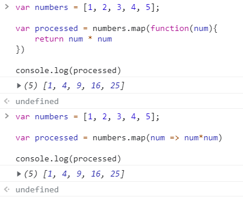
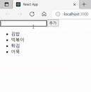

# 3주차 React 스터디 정리

| 장  | 제목                           |
| --- | ------------------------------ |
| 6장 | 컴포넌트 반복                  |
| 7장 | 컴포넌트와 라이프사이클 메서드 |
| 8장 | Hooks                          |

## 6장

**map이란 ?** 반복되는 컴포넌트를 사용해야 할 때 유용한 함수. 파라미터로 전달된 함수를 사용하여 새로운 배열을 생성한다.

<br />

### 6.1 자바스크립트 배열의 map() 함수

<**map 함수 문법**>  
**arr.map(callback, [thisArg])**

-   callback : 새로운 배열의 요소를 생성하는 함수. 3가지의 파라미터를 가진다.

    -   currentValue : 현재 처리하고 있는 요소
    -   index : 현재 처리하고 있는 요소의 index 값
    -   array : 현재 처리하고 있는 원본 배열

-   thisArg(선택항목) : callback 함수 내부에서 사용할 this 레퍼런스

<예제>

```jsx
var number = [1, 2, 3, 4, 5];

var processed = number.map(function (map) {
    return num * num;
});

console.log(processed);
```

위 예제 코드를 ES6 문법으로 간략하게 바꿀 수 있다.

```jsx
var number = [1, 2, 3, 4, 5];

var processed = number.map((num) => num * num);

console.log(processed);
```

실행결과는 아래와 같이 동일하며 number 배열을 이용한 새로운 배열이 나온 것을 볼 수 있다.



<br />

### 6.2 데이터 배열을 컴포넌트 배열로 변환하기

문자열로 이루어진 데이터배열로, li를 연속으로 사용해야 하는 경우의 예제를 만들어 볼 것이다.

```jsx
import React from "react";

const IterationSample = () => {
    const names = ["김밥", "떡볶이", "튀김", "어묵"];
    const nameList = names.map((name) => <li>{name}</li>);
    return <ul>{nameList}</ul>;
};

export default IteractionSample;
```

위 예제를 만들어보면, names에 선언한 문자열데이터들이 순서대로 잘 나오는 것을 볼 수 있다.  
그러나 웹페이지상으로는 문제 없이 보이지만, 개발자도구에 들어가면 <font color='red'>Warning 문구</font>가 떠있다.  
key prop이 존재하지 않는다는 경고문이고, 왜 key가 있어야 하는지 다음 절에서 알아볼 것이다.

<br />

### 6.3 key

**리액트에서의 key** : 컴포넌트 배열을 렌더링했을 때 어떤 원소에 변동이 있었는지 알아내려고 사용한다.

<br />

key가 없어도 _Virtual DOM_ 을 이용해 변화를 감지할 수 있으나,  
**key를 지정하는 것**이 변화를 알아내는 데에 더 빠른 도움이 된다.

key를 설정하는 데 유의해야할 점은 <mark>key값이 언제나 유일해야 한다는 점</mark>이다.  
그래서 데이터가 가진 고유한 값을 key값으로 설정한다.

이전에 만든 분식예제에 key값을 추가하게 되면,

```jsx
import React from "react";

const IteractionSample = () => {
    const names = ["김밥", "떡볶이", "튀김", "어묵"];
    const nameList = names.map((name, index) => <li key={index}>{name}</li>);
    return <ul>{nameList}</ul>;
};

export default IteractionSample;
```

개발자도구에 들어갔을 때, Warning 경고창이 사라진 것을 볼 수 있다.  
이때는 콜백함수의 인수인 index를 사용했으나 index는 고유한 값이 없을 때만 사용해야 한다.  
<mark style='background-color: #dcffe4'> -> index를 키로 사용하면 효율적으로 리렌더링하지 못하기 때문 ! </mark>

<br />

### 6.4 응용

지금까지는 우리가 미리 설정해놓은 정적인 배열을 사용했다면, 응용으로 동적인 배열을 사용할 것이다.

Input 창에 원하는 문자열을 입력하면, 리스트에 추가되어 추가된 문자열도 웹페이지 리스트에 보이도록 만들려고 한다.

```jsx
import React, { useState } from "react";

const IteractionSample = () => {
    const [names, setNames] = useState([
        { id: 1, text: "김밥" },
        { id: 2, text: "떡볶이" },
        { id: 3, text: "튀김" },
        { id: 4, text: "어묵" },
    ]);

    const [inputText, setInputText] = useState("");
    const [nextId, setNextId] = useState(5); //useState 안 숫자는 상태초기값. 현재 id는 4까지, 5부터 시작하기 위해 넣음.

    const onChange = (e) => setInputText(e.target.value);
    //추가버튼 클릭 시 onClick이벤트
    const onClick = () => {
        const nextNames = names.concat({
            id: nextId, //nextId를 id값으로 설정.
            text: inputText,
        });
        setNextId(nextId + 1); //다음에 입력할 text의 id값을 위해 +1 해줌.
        setNames(nextNames); // names 업데이트하기
        setInputText(""); //inputText 비우기
    };

    const namesList = names.map((name) => <li key={name.id}>{name.text}</li>);
    return (
        <div>
            <input value={inputText} onChange={onChange} />
            <button onClick={onClick}>추가</button>
            <ul>{namesList}</ul>
        </div>
    );
};

export default IteractionSample;
```



**-push와 concat의 차이점-**  
push : 기존 배열 자체를 변경  
concat : 기존 배열을 두고, 새로운 배열을 만듬

<mark>리액트에서 상태를 업데이트 할 땐, 기존 상태를 그대로 두고 새로운 값을 상태로 설정해야 한다.</mark>

이를 **불변성 유지**라고 하며, 불변성 유지가 필요한 이유는 ?  
-> 후에 리액트 컴포넌트의 성능을 최적화 할 수 있다 !

추가를 했다면, 추가한 요소를 삭제하는 법도 필요하다.  
DoubleCilck 이벤트를 이용하여 문자열을 삭제해보려고 한다.  
이때 사용할 함수는 filter 함수인데, 특정 조건에 해당하는 원소만 남길 수 있다.  
더블클릭 시, onRemove가 활성화되어 선택한 id와 같지 않은 원소들만 남겨 nextNames에 넣으라는 의미이다.

```jsx
const onRemove = (id) => {
    const nextNames = names.filter((name) => name.id !== id);
    setNames(nextNames);
};

const namesList = names.map((name) => (
    <li key={name.id} onDoubleClick={() => onRemove(name.id)}>
        {name.text}
    </li>
));
```

위 코드를 추가하여 실행해보면, 더블클릭 시 원하는 문자열을 지울 수 있다.

<br />

### 6.5 정리

<**기억할 점**>

1. **key값 설정 주의하기**
2. **배열 변경 시, 새로운 배열 만들고 새로운 상태로 설정하기**

## 7장

### 7.1 라이프사이클 메서드의 이해

내용 placeholder

### 7.2 라이프사이클 메서드 살펴보기

내용 placeholder

### 7.3 라이프사이클 메서드 사용하기

내용 placeholder

### 7.4 정리

내용 placeholder

## 8장

### 8.1 useState

내용 placeholder

### 8.2 useEffect

내용 placeholder

### 8.3 useReducer

내용 placeholder

### 8.4 useMemo

내용 placeholder

### 8.5 useCallback

내용 placeholder

### 8.6 useRef

내용 placeholder

### 8.7 커스텀 Hooks 만들기

내용 placeholder

### 8.8 다른 Hooks

내용 placeholder

### 8.9 정리

내용 placeholder

---

질문, 이해가 안 갔던 것, 궁금한 것, 스터디장이나 다른 사람들에게 물어보고 싶은 것, 기타 등등이 있으시면 써주시고, 이 문구는 지워주세요!
