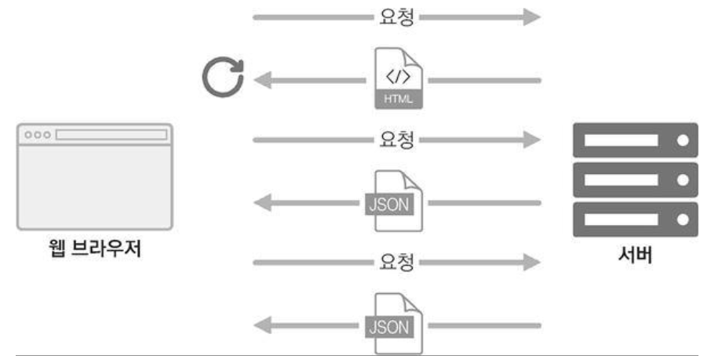

# 5주차 React 스터디 정리

| 장   | 제목                                 |
| ---- | ------------------------------------ |
| 13장 | 리액트 라우터로 SPA 개발하기         |
| 14장 | 외부 API를 연동하여 뉴스 뷰어 만들기 |

## 13장

### 13.1 SPA란?

> 💡 **SPA** : Single Page Application(싱글 페이지 애플리케이션)

하나의 페이지로 이루어진 애플리케이션이라는 의미를 갖는다.

📌 싱글 페이지라고 화면이 꼭 한 종류인 것은 아니다 !  
ex. 블로그화면(홈 화면/포스트목록/포스트/글쓰기) 과 같이 SPA의 경우 서버에서 사용하는 페이지는 한 종류이지만,  
 현재 사용자 브라우저의 주소 상태에 따라 다양한 화면을 보여줄 수 있다.

< 전통적인 웹 페이지 로딩구조 >  


기존 웹 페이지 구조를 보게 되면, 필요한 리소스를 서버측이 전달해 웹 브라우저가 해석하여 사용자에게 화면을 보여주었다.

오늘날에는 웹에서 제공하는 정보가 무수히 많기 때문에, 서버가 모든 뷰를 준비하는 전통적인 방식을 사용하게 된다면  
**성능상의 문제가 발생할 수 있다.**

<성능상의 문제 예시>

1. 트래픽이 많이 나올 수 있다.
2. 사용자가 몰려 서버에 높은 부하가 쉽게 걸린다.
3. 바뀌지 않는 부분까지 새로 불러와 불필요한 로딩이 있어 비효율적이다.

< SPA 구조 >  


-> **그래서 리액트 같은 라이브러리를 사용하면 필요한 부분만 자바스크립트를 이용하여 업데이트 해준다. 새로운 데이터가 필요하다면 서버 API를 호출하여 필요한 데이터만 새로 불러올 수 있다.**

> 💡 **라우팅** : 다른 주소에 다른 화면을 보여주는 것

리액트 라이브러리 자체에 있는 기능은 아님.  
대신 브라우저의 API를 직접 이용해 관리한다던지, 라이브러리를 사용하여 이 작업을 구현할 수 있다.

그럼 라이브러리 종류에는 무엇이 있을까 ?

-   **리액트 라우터**
-   **리치 라우터**
-   **Next.js**

이 중, 가장 역사가 긴 리액트 라우터는 -> **리액트 라우터**

리액트 라우터는 클라이언트 사이드에서 이루어지는 라우팅을 간단하게 구현할 수 있도록 해준다.  
후에 서버 사이드 렌더링을 할 때도 라우팅을 도와주는 컴포넌트들을 제공해준다.

> 클라이언트 사이드 : 서버에서 HTML 파일을 처리하지 않고, 브라우저의 자바스크립트를 통해 상호작용하는 방식.

> 서버 사이드 렌더링 : 서버에 HTML을 저장 후, 요청발생 시 모든 파일을 브라우저에 전달하는 방식.

< SPA 단점 >

1. 앱의 규모가 커지면 자바스크립트 파일도 커진다 -> 페이지 로딩 시 사용자가 방문하지 않는 페이지의 스크립트도 불러오기 때문 !  
   그러나 해결방법 존재 (ex. 코드 스플리팅)

2. 자바스크립트를 실행하지 않는 일반 크롤러에서는 페이지의 정보를 제대로 수집해 가지 못한다는 잠재적인 단점이 있다

3. 자바 스크립트가 실행될 때까지 페이지가 비어 실행되는 시간 동안 흰 페이지가 나타날 수 있다

-> 이런 문제들은 위에서 언급한 `서버 사이드 렌더링` 으로 해결할 수 있다 !

<br />

### 13.2 프로젝트 준비 및 기본적인 사용법

리액트 라우터를 사용해보기 위한 프로젝트를 하나 생성 후,  
그 프로젝트 폴더로 들어가 `리액트 라우터 라이브러리` 를 따로 설치 해야 한다.

-> **yarn add react-router-dom** 을 입력해준다

< 리액트 라우터를 프로젝트에 적용하려면 ? >

scr/index.js 파일로 들어가 상단 import에  
-> **import {BrowserRouter} from 'react-router-dom';** 을 추가 + 추가한 컴포넌트로 감싸주면 된다.

```javascript
ReactDOM.render(
    <BrowserRouter>
        <App />
    </BrowserRouter>,
    document.getElementById("root")
);
```

-> 위 컴포넌트는 페이지를 새로고침하지 않고도 주소를 변경하고, 현재 주소에 관련된 정보를 props로 쉽게 조회하고 사용할 수 있도록 해준다

<br />

사용자가 웹 사이트에 들어왔을 때 처음 보여줄 Home 화면/웹 사이트를 소개하는 About를 만들어볼 것이다.

```javascript
//Home.js
import React from "react";

const Home = () => {
    return (
        <div>
            <h1>Home</h1>
            <p>홈, 가장 먼저 보여지는 페이지</p>
        </div>
    );
};

export default Home;
```

```javascript
//About.js
import React from "react";

const About = () => {
    return (
        <div>
            <h1>소개</h1>
            <p>이 프로젝트는 리액트 라우터 기초를 실습해보는 예제 !</p>
        </div>
    );
};

export default About;
```

2가지의 컴포넌트를 만든 후, 사용자의 현재 주소경로에 따라 다른 컴포넌트를 보여주도록 **Route 컴포넌트**를 보여줄 것이다.  
App.js 파일에서 설정할 수 있다.  
-> 사용방식 : **< Route path="주소규칙" component={보여 줄 컴포넌트} />**

```javascript
//App.js 파일 상단에 Route를 사용하기 위한 import {Route} from 'react-router-dom'; 추가하기 !
const App = () => {
    return (
        <div>
            <Route path="/" component={Home} />
            <Route path="/about" component={About} />
        </div>
    );
};

export default App;
```

각 path에 따라 처음 들어간 기본 웹 화면에서는 Home.js의 모습이 보일 것이고,  
주소창 뒤에 /about 을 작성하게 되면 About.js도 함께 보일 것이다.


이때 /about을 입력하면 About 컴포넌트의 내용만이 표시될 줄 알았는데,  
Home 컴포넌트의 내용도 함께 출력되어 이유를 알아보니

-> /about의 경로가 Home 컴포넌트를 표시하는 /의 , / 규칙에도 일치하기 때문에 나타난 현상이다.

< 해결 방법 >
Home을 위한 Route 컴포넌트를 사용할 때 exact라는 props를 true로 설정하면 된다.

```javascript
<Route path="/" component={Home} />
//exact = {true} 를 추가해준다.
<Route path="/" component={Home} exact={true} />
```

다시 브라우저 주소창에 /about을 입력하면 About 컴포넌트의 내용만이 표시되는 것을 확인할 수 있다.

지금까지 한 것은 개발하는 사람들이 직접 경로를 입력하여 옮겨다닐 수 있으나,  
사용자의 입장에서는 경로를 이동시킬 수 있는 **링크(Link)** 가 필요하다.

일반적으로 링크를 설정할 때는 a 태그를 사용했으나,  
📌**리액트 라우터에서는 이 태그를 사용해선 안된다 !**

< 이유 >
a 태그는 페이지를 전환하는 과정에서 페이지를 새로 불러오기 때문에 앱이 들고 있던 상태들을 모두 날려버린다.  
즉, **렌더링 된 컴포넌트들도 모두 사라지고, 다시 처음부터 렌더링하게 된다.**

그래서 사용하는 것이 **링크(Link) 컴포넌트** 이다.  
이걸 사용하여 페이지를 전환하면, 페이지를 새로 불러오지 않고 앱은  
그대로 유지한 상태로 API를 사용하여 페이지의 주소만 변경해준다.  
링크 컴포넌트 안에는 a 태그가 내장되어 있으나, 페이지변환을 방지하는 기능이 있다.

-> 사용방식 : **<Link to="주소">내용</Link>**

```javascript
//Link 컴포넌트를 사용하기 전, 상단에 import {Route, Link} 추가해주기 !
const App = () => {
    return (
        <div>
            <ul>
                <li>
                    <Link to="/">Home</Link>
                </li>
                <li>
                    <Link to="/about">소개</Link>
                </li>
            </ul>
            <hr />
            <Route path="/" component={Home} exact={true} />
            <Route path="/about" component={About} />
        </div>
    );
};

export default App;
```


위와 같이 2가지 링크가 잘 만들어진 것을 확인할 수 있다.

<br />

### 13.3 Route 하나에 여러 개의 path 설정하기

윗 절에서는 하나의 Route에 하나의 path만을 설정했다.

최신 버전의 리액트 라우터 v5부터 적용된 기능인데, 하나의 Route에 여러 개의 path를 지정할 수 있게 되었다.

과거에는 < Route path ~ > 절을 여러 번 사용했다면,  
현재는 **path props** 를 배열로 설정하여 여러 경로에서 같은 컴포넌트를 보여줄 수 있다.

만약, About 컴포넌트의 내용을 /about 과 /info 라는 2가지 경로를 이용하여 보여주고 싶다면

```javascript
<Route path={["/about", "/info"]} component={About} />
```

과 같이 path에 경로 배열을 넣으면 된다.

<br />

### 13.4 URL 파라미터와 쿼리

홈 화면이나 소개 화면과 같이 동적인 페이지 말고, **사용자 정보에 따라 달라지는 유동적인 값**을 사용해야 하는 상황에서는

1. 파라미터 사용
2. 쿼리 사용

2가지의 방법으로 나눌 수 있다.

무조건 따라하는 규칙은 없으나 일반적으로

-   **파라미터 : 특정 아이디 혹은 이름을 사용하여 조회할 때 사용**
-   **쿼리 : 어떤 키워드를 검색하거나 페이지에 필요한 옵션을 전달할 때 사용**

< 파라미터를 사용한 예제 코드 >

```javascript
//Profile.js
import React from "react";

const data = {
    velopert: {
        name: "김수정",
        description: "리액트를 좋아하는 개발자",
    },
    gildong: {
        name: "홍길동",
        description: "고전 소설 주인공",
    },
};

const Profile = ({ match }) => {
    const { username } = match.params;
    const profile = data[username];
    if (!profile) {
        return <div>존재하지 않는 사용자입니다.</div>;
    }
    return (
        <div>
            <h3>
                {username}({profile.name})
            </h3>
            <p>{profile.description}</p>
        </div>
    );
};

export default Profile;
```

```javascript
//App.js
const App = () => {
    return (
        <div>
            <ul>
                <li>
                    <Link to="/">Home</Link>
                </li>
                <li>
                    <Link to="/about">소개</Link>
                </li>
                <li>
                    <Link to="/profile/velopert">velopert 프로필</Link>
                </li>
                <li>
                    <Link to="/profile/gildong">gildong 프로필</Link>
                </li>
            </ul>
            <Route path="/" component={Home} exact={true} />
            <Route path={["/about", "/info"]} component={About} />
            <Route path="/profile/:username" component={Profile} />
        </div>
    );
};

export default App;
```

Profile.js 컴포넌트 파일에서 임의로 2가지 user정보를 추가한다.  
그 다음 route에서 component로 정보를 넘기기 위해 match를 사용한다.

App.js의 < Route path="/profile/:username" component={Profile} / > 에서  
**/: 뒷 부분은 파라미터로 전해줄 props의 이름이라고 보면 된다.**
즉, match.params.username 값을 통해 현재 username의 값을 조회할 수 있다.

그래서 velopert 링크를 누르면 username이 velopert에 해당하는 정보를 불러오고,  
gildong 링크를 누르면 gildong에 해당하는 정보를 불러오게 된다.


< 쿼리를 사용한 예제 코드 >

> 쿼리는 location 객체에 들어 있는 search 값에서 조회할 수 있다.

location 객체는 라우트로 사용된 컴포넌트에게 props로 전달되고, 웹 애플리케이션 현재 주소에 대한 정보를 담고 있다.

```javascript
//location의 형태
{
   "pathname" : "/about",
   "search" : "?detail=true",
   "hash" : ""
}
//위 객체는 <localhost주소/about?detail=true> 주소로 들어갔을 때의 값
```

URL 쿼리를 읽을 때는 search 값을 확인해야 한다.  
search 값에서 특정 값을 읽어 오기 위해서는 문자열을 객체 형태로 변환해주어야 한다.  
쿼리 문자열을 객체로 변환 할 때는 `qs 라이브러리` 를 사용한다.

`qs 라이브러리` 는 따로 설치해주어야 하기 때문에 yarn add qs 명령어를 이용해서 설치해준다.

qs 라이브러리를 적용시킬 About.js 컴포넌트 파일 상단에는

-> import qs from 'qs' 를 해주어야 한다 !

```javascript
import React from "react";
import qs from "qs";

const About = ({ location }) => {
    const query = qs.parse(location.search, {
        ignoreQueryPrefix: true, //문자열 맨 앞의 ?을 생략하는 문장
    });
    const showDetail = query.detail === "true"; //쿼리의 파싱 결과 값은 문자열
    return (
        <div>
            <h1>소개</h1>
            <p>이 프로젝트는 리액트 라우터 기초를 실습해보는 예제 !</p>
            {showDetail && <p>detail 값을 true로 설정했군요 !</p>}
        </div>
    );
};

export default About;
```

쿼리를 사용할 때는 쿼리 문자열을 객체로 파싱하는 과정에서 결과 값이 언제나 **문자열** 이다.  
ex. ?value=1, ?value=true 와 같이 숫자 1, boolean 값 true가 아닌 **"1", "true"** 라는 의미

그래서 숫자를 받아와야 하는 경우라면 **parseInt 함수** 를 이용해 숫자로 변환해주고,  
위 예제처럼 논리 자료형 값을 사용해야 하는 경우라면 "true" 문자열이랑 일치하는지 확인해야 한다 !


주소창에 ?detail=true 값을 추가해주면 About 페이지에 새로운 문구가 뜨는 것을 확인해볼 수 있다.

<br />

### 13.5 서브 라우트

> 💡**서브 라우트** : 라우트 내부에 또 다른 라우트를 정의하는 것

-> 쉽게 생각하면, 라우트로 사용되고 있는 컴포넌트 안에 라우트를 또 설정해주면 된다.

기존 윗 절의 예제에서는 App 컴포넌트에서 라우트들을 설정했었다면,  
이번 예제는 Profile 컴포넌트 안에도 라우트를 설정해볼 것이다.

새로운 Profiles.js 라는 컴포넌트를 만든 후,

```javascript
import React from "react";
import { Route, Link } from "react-router-dom";
import Profile from "./Profile";

const Profiles = () => {
    return (
        <div>
            <h3>사용자 목록 :</h3>
            <ul>
                <li>
                    <Link to="/profiles/velopert">velopert</Link>
                </li>
                <li>
                    <Link to="/profiles/gildong">gildong</Link>
                </li>
            </ul>

            <Route
                path="/profiles"
                exact
                render={() => <div>사용자를 선택해 주세요.</div>}
            />
            <Route path="/profiles/:username" component={Profile} />
        </div>
    );
};

export default Profiles;
```

코드를 보면 Route 2개가 선언되어 있는데,

첫 번째 Route에는 component={} 대신 render를 넣어주었다.  
이때 render을 넣은 이유는 ?  
=> **Route에서는 컴포넌트 자체 전달만이 아니라 보여주고 싶은 JSX를 설정하여 보여줄 수 있다.**  
=> 컴포넌트에 props를 별도로 넣고 싶을 때도 사용할 수 있다.

위 코드에서 exact라고만 적은 이유는 JSX에서 props를 설정할 때 값을 생략하면 자동으로 true가 된다.  
그래서 exact={true} 와 같은 의미다.

Profiles 컴포넌트 내부에 라우트를 넣어 velopert와 gildong의 데이터가 들어있는 Profile 컴포넌트로 이동되게 만들었으므로  
App 컴포넌트에서 각 Profile 별로 만들어놓은 링크를 지우고 Profiles로 통하는 링크를 설정해준다.

프로필 링크로 또 들어가게 되면, Profiles 내부에서 설정한 Profile 링크 2가지가 생기는 것을 볼 수 있다.


<br />

### 13.6 리액트 라우터 부가 기능

라우터의 부가 기능으로는 `history 객체` 를 사용할 수 있다.

> **history 객체** : 라우트로 사용된 컴포넌트에 match, location과 함께 전달되는 props 중 하나로 이 객체를 통해 컴포넌트 내에 구현하는 메서드에서 라우트 API를 호출할 수 있다.

< 사용되는 예시 >  
ex. 특정 버튼을 눌렀을 때 뒤로 가기, 로그인 후 화면 전환하기, 다른 페이지로 이탈하는 것을 방지하기

```javascript
import React, { Component } from "react";

class HistorySample extends Component {
    //뒤로 가기
    handleGoBack = () => {
        this.props.history.goBack();
    };

    //홈으로 가기
    handleGoHome = () => {
        this.props.history.push("/");
    };

    componentDidMount() {
        //이 함수 설정 시 페이지 변화가 생길 때마다 설정한 질문을 한다
        this.unblock = this.props.history.block("정말 떠나실 건가요?");
    }

    componentWillUnmount() {
        //컴포넌트가 언마운트 될 시 질문 멈춤
        if (this.unblock) {
            this.unblock();
        }
    }

    render() {
        return (
            <div>
                <button onClick={this.handleGoBack}>뒤로</button>
                <button onClick={this.handleGoHome}>홈으로</button>
            </div>
        );
    }
}

export default HistorySample;
```

HistorySample 컴포넌트를 만든 후 App 컴포넌트에서 HistorySample 컴포넌트로 가는 경로를 만들게 되면  
HistorySample 내부에서 history 객체를 사용해 만든 뒤로가기, 홈으로 가기 2가지의 버튼이 나타나는 것을 볼 수 있다.


history 객체를 사용하는 것 말고도 추가적인 부가 기능이 있다.

> **withRouter 함수(HoC)** : 라우트로 사용된 컴포넌트가 아니어도 match, location, history 객체를 접근할 수 있게 해 준다.

withRouter 함수를 사용한 예제를 하나 만들어보면

```javascript
import React from "react";
import { withRouter } from "react-router-dom";

const WithRouterSample = ({ location, match, history }) => {
    return (
        <div>
            <h4>location</h4>
            <textarea
                //JSON.stringify의 2,3번째 파라미터를 이와 같이 설정하면, 들여쓰기가 적용된다
                value={JSON.stringify(location, null, 2)}
                row={7}
                readOnly={true}
            />
            <h4>match</h4>
            <textarea
                value={JSON.stringify(match, null, 2)}
                row={7}
                readOnly={true}
            />
            <button onClick={() => history.push("/")}>홈으로</button>
        </div>
    );
};

export default withRouter(WithRouterSample);
```

다른 컴포넌트들과의 차이를 하나 볼 수가 있는데,  
바로 컴포넌트를 내보낼 때 **withRouter 함수** 로 감싸내보낸다는 것이다.

이 컴포넌트를 Profiles 컴포넌트 안에 넣어주어 적용시키면,


withRouter로 내보낸 컴포넌트가 나타나는 것을 볼 수 있다.  
각 textarea에는 location과 match 객체에 대한 정보가 쓰여져있다.

match textarea에서 params가 비어있는 이유에는

=> withRouter는 현재 자신을 보여주는 라우트 컴포넌트를 기준으로 match를 전달한다.  
withRouter가 들어있는 Profiles 컴포넌트에는 username이 담겨 있지 않으므로 빈 것으로 표시되는 것이다.  
그래서 withRouter를 Profiles 컴포넌트가 아니라 velopert와 gildong 내용이 담겨 있는 Profile 컴포넌트로 옮기면  
URL 파라미터가 제대로 보인다.

ex. Profile 컴포넌트로 WithRouterSample 컴포넌트를 옮겨보았더니 params 객체정보가 velopert와 gildong마다 잘 보이는 것을 확인할 수 있다.


라우터 부가 기능 중 다른 것은 `Switch 컴포넌트다`.

> **Switch 컴포넌트** : 여러 Route를 감싸서 그 중 일치하는 하나의 라우트만 렌더링시킨다.

ex. '일치한다'라는 조건을 가지고 있으므로, 이 컴포넌트를 이용해 Not Found 페이지까지 만들 수 있다.

App 컴포넌트에 추가로 Switch 기능을 넣어보면

```javascript
//Switch를 사용하려면 상단에 추가해주어야 한다
import {Route, Link, Switch} from 'react-router-dom';

(...)

      <Switch>
        <Route path="/" component={Home} exact={true} />
        <Route path={['/about', '/info']} component={About}/>
        <Route path="/profiles" component={Profiles} />
        <Route path="/history" component={HistorySample} />

        <Route
          //path를 따로 정의하지 않으면 모든 상황에 렌더링된다
          render={(location) => (
            <div>
              <h2>이 페이지는 존재하지 않습니다 :</h2>
              <p>{location.pathname}</p>
            </div>
          )}
        />
      </Switch>
```

Switch 컴포넌트로 감싸준 후, 규칙에 어긋날 시 보여줄 문구를 작성하면  
감싼 경로 중 해당하지 않는 경로가 있다면 문구가 보여지게 된다.

이 책에 나오는 라우터 부가 기능 중 마지막 기능은 `NavLink` 이다.

> **NavLink** : 현재 경로와 Link에서 사용하는 경로가 일치하는 경우 특정 스타일 혹은 CSS 클래스를 적용할 수는 컴포넌트다.

NavLink에서 링크가 활성화 되었을 때,

스타일을 적용할 때는 `activeStyle` 값  
CSS 클래스를 적용할 때는 `activeClassName 값을 props로` 넣는다.

<br />

### 13.7 정리

지금까지 한 예제들은 크게 보면 문제가 생긴다.

바로 소개 페이지에서 당장 필요하지 않은 Profile 컴포넌트까지 불러온다는 점이다.

앞으로는 라우트에 따라 필요한 컴포넌트만 불러오고, 다른 컴포넌트는 다른 페이지를 방문하는 등 필요한 시점에 따라  
불러오면 더 효율적인 웹페이지를 만들 수 있다.  
그리고 이를 해결해주는 기술 중 하나가 `코드 스플리팅` 이다.

## 14장

### 14.1 비동기 작업의 이해

내용 placeholder

### 14.2 axios로 API 호출해서 데이터 받아 오기

내용 placeholder

### 14.3 newsapi API 키 발급받기

내용 placeholder

### 14.4 뉴스 뷰어 UI 만들기

내용 placeholder

---

질문, 이해가 안 갔던 것, 궁금한 것, 스터디장이나 다른 사람들에게 물어보고 싶은 것, 기타 등등이 있으시면 써주시고, 이 문구는 지워주세요!
