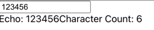

# 6주차 React 스터디 정리

| 장   | 제목                                 |
| ---- | ------------------------------------ |
| 14장 | 외부 API를 연동하여 뉴스 뷰어 만들기         |
| 전역상태관리 | recoil |

## 14 장

### 14.5 데이터 연동하기 
NewsList 컴포넌트에서 useEffect로 API를 호출하면 된다.  
이때 async/await를 그냥 사용하면 clean-up 함수가 되므로. 
이를 사용한다면 별도의 함수를 만들어 사용해야 한다.
src/components/NewsList.js
```jsx
import styled from "styled-components";
import {useEffect, useState} from "react";

import {Api} from "../lib/custormAxios";
import NewsItem from "./NewsItem";
import {ServerPath} from "../lib/path";

const NewsListBlock = styled.div`
  box-sizing: border-box;
  padding-bottom: 3rem;
  width: 768px;
  margin: 0 auto;
  margin-top: 2rem;
  @media screen and (max-width: 768px) {
    width: 100%;
    padding-left: 1rem;
    padding-right: 1rem;
  }
`;

const NewsList = () => {
  const [articles, setArticles] = useState(null);
  const [loading, setLoading] = useState(false);

  useEffect(() => {
    setLoading(true);

    Api({
      method: 'GET',
      url: `${process.env.REACT_APP_API_ORIGIN}${ServerPath.getNews}`,
      params: {
        country: `${process.env.REACT_APP_API_COUNTRY}`,
        apiKey: `${process.env.REACT_APP_API_KEY}`,
      }
    })
      .then(({data: {articles}}) => {
        setArticles(articles);
      })
      .catch(err => err);

    setLoading(false);
  }, []);

  if(loading) {
    return <NewsListBlock>로딩 중...</NewsListBlock>
  }

  if(!articles) {
    return null;
  }

  return (
    <NewsListBlock>
      {articles.map(articles => (
        <NewsItem key={articles.url} article={articles} />
      ))}
    </NewsListBlock>
  )
}

export default NewsList;
```

### 14.6 카테고리 기능 구현하기 

카테고리는 한글로 보여주되 내부적으로 사용하는 값은 영어로 한다. 
이를 위해 카테고리 리스트를 가지고 있는 객체를 선언하자. 여기서  
name은 key값, text는 실제로 보여지는 카테고리이다.
src/lib/categories.js
```js
const categories = [
  {
    name: 'all',
    text: '전체보기',
  },
  {
    name: 'business',
    text: '비즈니스',
  },
  {
    name: 'entertainment',
    text: '엔터테인먼트',
  },
  {
    name: 'health',
    text: '건강',
  },
  {
    name: 'science',
    text: '과학',
  },
  {
    name: 'sports',
    text: '스포츠',
  },
  {
    name: 'technology',
    text: '과학',
  },
];

export default categories;
```
이제 화면에 보여질 카테고리 컴포넌트를 만들자.  
```jsx
import styled from "styled-components";

import categories from "../lib/categories";

const CategoriesBlock = styled.div`
  display: flex;
  padding: 1rem;
  width: 768px;
  margin: 0 auto;
  @media screen and (max-width: 768px) {
    width: 100%;
    overflow-x: auto;
  }
`;

const Category = styled.div`
  font-size: 1.125rem;
  cursor: pointer;
  white-space: pre;
  text-decoration: none;
  color: inherit;
  padding-bottom: 0.25rem;
  
  &:hover {
    color: #495057;
  }
  
  & + & {
    margin-left: 1rem;
  }
`;

const Categories = () => {
  return (
    <CategoriesBlock>
      {categories.map(({name, text}) => (
        <Category key={name}>{text}</Category>
      ))}
    </CategoriesBlock>
  );
};

export default Categories;
```

이제 선택한 카테고리를 명시적으로 보여주는 기능을 만들자.  
전역상태관리툴을 사용하지 않기 때문에 상태를 최상위 컴포넌트에 선언하자.  
```jsx
import {useCallback, useState} from "react";

import Categories from "./components/Categories";
import NewsList from "./components/NewsList";

function App() {
  const [category, setCategory] = useState('all');

  const handleSelect = useCallback(category => setCategory(category), []);

  return (
    <>
      <Categories category={category} handleSelect={handleSelect} />
      <NewsList category={category} />
    </>
  );
}

export default App;

```
이제 Categories컴포넌트에서 전달받은 props를 사용해 현재. 
선택된 카테고리를 하이라이트 하는 기능을 만들면 된다.  
src/components/Categories.js
```jsx
import styled, {css} from "styled-components";
import PropTypes from 'prop-types';

import categories from "../lib/categories";

const CategoriesBlock = styled.div`
  //...
  
  ${({active}) => active && css`
    font-weight: 600;
    border-bottom: 2px solid #22b8cf;
    color: #22b8cf;
    &:hover {
      color: #3bc9db;
    }
  `}
`;

const Categories = ({handleSelect, category}) => {
  return (
    <CategoriesBlock>
      {categories.map(({name, text}) => (
        <Category
          key={name}
          active={category === name}
          onClick={() => handleSelect(name)}
        >
          {text}
        </Category>
      ))}
    </CategoriesBlock>
  );
};

Categories.propTypes = {
  handleSelect: PropTypes.func,
  categories: PropTypes.string,
};

export default Categories;
```


이제 지정된 카테고리에 대해 검색을 하는 기능을 만들자. axios요청에서  
쿼리에 category를 추가하면 된다.
src/components/NewsList.js
```jsx
//...
const NewsList = ({category}) => {
 //...
  useEffect(() => {
    setLoading(true);

    Api({
      method: 'GET',
      url: `${process.env.REACT_APP_API_ORIGIN}${ServerPath.getNews}`,
      params: {
        country: `${process.env.REACT_APP_API_COUNTRY}`,
        category: `${category === 'all' ? '' : category}`,
        apiKey: `${process.env.REACT_APP_API_KEY}`,
      }
    })
      .then(({data: {articles}}) => {
        setArticles(articles);
      })
      .catch(err => err);

    setLoading(false);
  }, [category]);

  //...

  return (
    <NewsListBlock>
     //...
    </NewsListBlock>
  )
}

NewsList.propTypes = {
  category: PropTypes.string.isRequired,
}
```
### 14.7 리액트 라우터 적용하기 

이번에는 카테고리를 상태로 관리하는 것이 아닌 파라미터로 관리를 해보자.  
src/index.js
```jsx
//...
ReactDOM.render(
  <React.StrictMode>
    <BrowserRouter>
      <App />
    </BrowserRouter>
  </React.StrictMode>,
  document.getElementById('root')
);
//...
```
src/App.js. 
여기서 path에 존재하는 ?는 선택적이라는 의미이다.
```jsx
import {Route} from 'react-router-dom';
import NewsPage from "./pages/NewsPage";

function App() {
  return (
    <Route path='/:category?' component={NewsPage}/>
  )
}

export default App;

```
src/pages/NewsPage.js
```jsx
import {useParams} from "react-router-dom";

import Categories from "../components/Categories";
import NewsList from "../components/NewsList";

const NewsPage = () => {
  const {category} = useParams();

  return (
    <>
      <Categories />
      <NewsList category={category || 'all'}/>
    </>
  )
}

export default NewsPage;
```
src/components/Categories.js
```jsx
import styled from "styled-components";

import categories from "../lib/categories";
import {NavLink} from "react-router-dom";

const CategoriesBlock = styled.div`
  //...
`;

const Category = styled(NavLink)`
  font-size: 1.125rem;
  cursor: pointer;
  white-space: pre;
  text-decoration: none;
  color: inherit;
  padding-bottom: 0.25rem;
  
  &:hover {
    color: #495057;
  }
  
  & + & {
    margin-left: 1rem;
  }
  
 &.active {
   font-weight: 600;
   border-bottom: 2px solid #22b8cf;
   color: #22b8cf;
   &:hover {
     color: #3bc9db;
   }
 } 
`;

const Categories = () => {
  return (
    <CategoriesBlock>
      {categories.map(({name, text}) => (
        <Category
          key={name}
          activeClassName="active"
          //전체보기의 path가 /이므로 exact를 true로
          //해야 한다. 적용하지 않으면 다른 카테고리 선택시에도
          //전체링크가 선택된거 처럼 보인다.
          exact={name === 'all'}
          to={name === 'all' ? '/' : `/${name}`}
        >
          {text}
        </Category>
      ))}
    </CategoriesBlock>
  );
};

export default Categories;
```
### 14.8 usePromise custom hook 만들기 
cutom hook을 사용해 프로젝트를 더 간결히 만들어 보자.  
만들 훅은 usePrmise로 NewsList.js에서 api를 받아오는 부분이다.
src/lib/usePromise.js
```jsx
import {useEffect, useState} from "react";

export default function usePromise(promiseCreator, deps) {
  const [loading, setLoading] = useState(false);
  const [resolved, setResolved] = useState(null);
  const [error, setError] = useState(null);

  useEffect(() => {
    const process = async () => {
      setLoading(true);
      try {
        const resolved = await promiseCreator();
        setResolved(resolved);
      }
      catch(err) {
        setError(err);
      }
      setLoading(false);
    }
    process();
  }, deps);

  return [loading, resolved, error];
}
```
src/components/NewsList.js
```jsx
//...
const NewsList = ({category}) => {
  const [loading, response, error] = usePromise(() => {
    return Api({
      method: 'GET',
      url: `${process.env.REACT_APP_API_ORIGIN}${ServerPath.getNews}`,
      params: {
        country: `${process.env.REACT_APP_API_COUNTRY}`,
        category: `${category === 'all' ? '' : category}`,
        apiKey: `${process.env.REACT_APP_API_KEY}`,
      }
    })
      .then(res => res)
      .catch(err => err);
  }, [category]);


  if(loading) {
    return <NewsListBlock>로딩 중...</NewsListBlock>
  }

  if(!response) {
    return null;
  }

  if(error) {
    return <NewsListBlock>에러 발생</NewsListBlock>
  }

  const {data: {articles}} = response;
  return (
    <NewsListBlock>
      {articles && articles.map(articles => (
        <NewsItem key={articles.url} article={articles} />
      ))}
    </NewsListBlock>
  )
}
//...
```
### 14.9 정리 
useEffect내부에서는 async로 함수 작성을 하지 말것.  
커스텀 훅을 사용해 코드가 간결해 지긴 했으나 전역상태관리툴을 사용하면  
상태관리가 더 쉬워진다.

## Observer pattern
상태가 지속적으로 변하는 객체가 있다고 하고 그 객체를 a라 하자. 그리고 a의 상태가 변하는 것을 알아야 하는 n(n은 자연수)개의  
객체가 있다고 하고 이 객체들을 각각 b1, b2, ..., bn이라 해자.  
객체 bi(1 <= i <= n)들이 a의 상태 변화를 알기 위한 방식중 하나는 a에 접근해 상태 변화 유무를 확인하는 것이다. 이런 방식을  
polling이라 한다. 하지만 이런 방식은 a의 상태 변화가 없을 때도 bn들이 a에 접근해 확인을 한다는 문제점이 존재 한다. 따라서  
bi들이 a에 접근해 a의 상태변화 유무를 체크하는 것이 아닌 a가 상태 변화가 발생했을때 bi들에게 알리는 것이 observer pattern이다.  
a의 상태가 변했을때 bn들에게 알리기 위해서는 a가 bn들의 리스트를 가지고 있어야 한다. a가 bi를 상태변화  
알림에 추가하는 것을 구독이라 하고 a를 observable, bi를 observer라 한다. 
```ts
interface Observer {
  name: string;
  update(message: string): void;
}

interface Observable {
  observers: Array<Observer>;
  subscribe(observer: Observer): void;
  unsubscribe(observer: Observer): void;
  updateState(): void;
  notify(message: string): void;
}

class RealObservable implements Observable {
  observers: Array<Observer>;

  constructor() {
    this.observers = [];
  }

  subscribe(observer: Observer): void {
    this.observers = this.observers.concat(observer);
  }

  unsubscribe(observer: Observer): void {
    this.observers = this.observers.filter((ob) => {
      return ob.name !== observer.name;
    });
  }

  updateState() {
    this.notify("상태 업데이트");
  }

  notify(message: string): void {
    this.observers.map((observer, idx) => {
      return observer.update(message + idx);
    });
  }
}

class RealObserver implements Observer {
  name: string;

  constructor(name: string) {
    this.name = name;
  }

  update(message: string) {
    console.log(message);
  }
}

function main() {
  const observable = new RealObservable();
  const observer1 = new RealObserver("1");
  const observer2 = new RealObserver("2");
  const observer3 = new RealObserver("3");

  observable.subscribe(observer1);
  observable.subscribe(observer2);
  observable.subscribe(observer3);

  observable.updateState();
  //출력:
  //상태 업데이트 0
  //상태 업데이트 1
  //상태 업데이트 2

  observable.unsubscribe(observer1);

  observable.updateState();
  //출력:
  //상태 업데이트 0
  //상태 업데이트 1
}

main();

```

## recoil 

### 주요 개념 
data flow: atom(공유상태)->selectors(순수함수)->react component. 
atom: 컴포넌트가 구독핳 수 있는 상태의 단위.  
selectors: atoms 상태값을 동기, 비동기 방식을 통해 변환.   
부수 효과: 함수가 함수 외부의 상태를 변경하거나 함수의 인자 값을 변경하는 것.  
순수함수의 조건:  
  1. 동일한 인자를 주었을때 항상 같은 값을 반환하는 함수. 
  2. 외부 상태에 영향을 주지 않는 함수
  
Atom  
상태의 단위이고 업데이트와 구독이 가능하다. atom이 업데이트 외면 각각의 구독된 컴포넌트는 새 값을 반영해 리렌터링된다.  
atoms는 런타인에서 생성될 수도 있다. Atoms는 React의 로컬 컴포넌트의 상태 대신 사용할 수 있다.  
Atoms는 디버깅, 지속성 및 모든 atoms의 map을 볼 수 있는 특정 고급 API에 사용되는 고유한 키가 필요하다. 두개의  
atom이 같은 키를 갖는 것은 오류이기 때문에 키값은 전역적으로 고유하도록 해야한다. React 컴포넌트의 상태처럼 기본값도 가진다.  
```js
const fonstSizeState = atom({
  key: 'fontSizeState',
  default: 14,
})
```
컴포넌트에서 atom을 읽고 쓰려면 useRecoilState()를 사용하면 된다. useState와 비슷하지만 상태가 다른 컴포넌트에  
공유된다는 점이 다르다
```jsx
const [fontSize, setFontSize] = useRecoilState(fontSizeState);
```
위의 아톰에 대한 설명을 통해 아톰은 내부적으로 맵을 사용한다는 추측을 할 수 있다. 실제로 맵을 사용하는지를 찾아보기 위해  
recoil을 뜯어보았다.  
recoil/umd/recoil.js
```js
// flowlint-next-line unclear-type:off
  const nodes = new Map(); // flowlint-next-line unclear-type:off

  const recoilValues = new Map();
  /* eslint-disable no-redeclare */

  function recoilValuesForKeys(keys) {
    return Recoil_mapIterable(keys, key => Recoil_nullthrows(recoilValues.get(key)));
  }

  function registerNode(node) {
    if (nodes.has(node.key)) {
      const message = `Duplicate atom key "${node.key}". This is a FATAL ERROR in
      production. But it is safe to ignore this warning if it occurred because of
      hot module replacement.`; // TODO Need to figure out if there is a standard/open-source equivalent to see if hot module replacement is happening:
      // prettier-ignore
      // @fb-only: if (__DEV__) {
      // @fb-only: const isAcceptingUpdate = require('__debug').isAcceptingUpdate;
      // prettier-ignore
      // @fb-only: if (typeof isAcceptingUpdate !== 'function' || !isAcceptingUpdate()) {
      // @fb-only: expectationViolation(message, 'recoil');
      // @fb-only: }
      // prettier-ignore
      // @fb-only: } else {
      // @fb-only: recoverableViolation(message, 'recoil');
      // @fb-only: }

      console.warn(message); // @oss-only
    }

    nodes.set(node.key, node);
    const recoilValue = node.set == null ? new Recoil_RecoilValue$1.RecoilValueReadOnly(node.key) : new Recoil_RecoilValue$1.RecoilState(node.key);
    recoilValues.set(node.key, recoilValue);
    return recoilValue;
  }
```
Selectors  
Selector는 atoms나 다른 selectors를 입력으로 받는 순수함수이다. 상위의 atoms나 selectors가 업데이트 되면 하위의  
selector함수도 다시실행된다. 컴포넌트들은 selectors를 구독할 수 있고 selectors가 변경되면 컴포넌트들도 리렌더링된다.  
selectors는 파생 데이터를 계산하는데에 도움을 준다. 반드시 필요한 상태만 atoms에 저장 하고 다른 파생 데이터는 selectors에  
명시해 함수를 통해 효율적인 계산을 하자.  
selectors는 자신을 구독한 컴포넌트를 알고있기 때문에 함수적 접근방식을 효율적으로 만든다. 컴포넌트 관점에서 selector와  
atoms는 동일한 인터페이스를 가지고 있다. 
```jsx
const fontSizeLabelState = selector({
  key: 'fontSizeLabelState',
  get: ({get}) => {
    const fontSize = get(fontSizeState);
    const unit = 'px';
    return `${fontSize}${unit}`;
  }
});
```
get인자를 통해 atoms와 다른 selectors에 접근할 수 있다. 다른 atoms나 selectors에 접근하면 종속관계가 생성되기 때문에  
참소했던 다른 atoms나 selectors가 업데이트되면 이 함수도 다시 실행된다. 이 예시는 fontSizeState의존성을 갖는다.  
useRecoilvalue()는 하나의 atom이나 selector를 인자로 받아 대응하는 값을 반환한다. fontSizeLabelState는 writable  
하지 않기 떄문에 useRecoilState()를 이용하지 않는다.
### 설치
[설치](https://recoiljs.org/ko/docs/introduction/installation)

### Recoil 시작하기

recoil 상태를 사용하는 컴포넌트는 부모 트리에 RecoilRoot가 필요하다. 루트 컴포넌트가 RecoilRoot를 사용하기 가장 적합하다.  
src/App.js
```jsx
import {RecoilRoot} from "recoil";

import CharacterCounter from "./pages/CharacterCounter";

function App() {
  return (
    <RecoilRoot>
      <CharacterCounter />
    </RecoilRoot>
  );
}

export default App;
```
src/store/textState.js
```jsx
import {atom, selector} from "recoil";

export const textState = atom({
  key: 'textState-textState',
  default: '',
});

export const charCountState = selector({
  key: 'textState-charCountState',
  get: ({get}) => {
    const text = get(textState);

    return text.length;
  },
});
```
src/components/TextInput.js
```jsx
import {useRecoilState} from "recoil";

import {textState} from "../store/textState";

const TextInput = () => {
  const [text, setText] = useRecoilState(textState);

  const handleChange = ({target: {value}}) => {
    setText(value);
  }

  return (
    <>
      <input
        type="text"
        value={text}
        onChange={handleChange}
      />
      <br/>
      Echo: {text}
    </>
  );
}

export default TextInput;
```
src/components/CharacterCount.js
```jsx
import {charCountState} from "../store/textState";
import {useRecoilValue} from "recoil";

const CharacterCount = () => {
  const count = useRecoilValue(charCountState);

  return (
    <>
      Character Count: {count}
    </>
  );
}

export default CharacterCount;
```
src/pages/CharacterCounter.js
```jsx

import CharacterCount from "../components/CharacterCount";
import TextInput from "../components/TextInput";

const CharacterCounter = () => {
  return (
    <>
      <TextInput />
      <CharacterCount />
    </>
  );
}

export default CharacterCounter;
```

### 도입부

다음과 같은 기능을 가지는 todo list를 제작한다.  
1.todo 아이템 추가  
2.todo 아이템 수정  
3.todo 아이템 삭제  
4.todo 아이템 필터링  
5.유용한 통계 표시

### Atoms

Atoms는 애플리케션 상태의 source of truth를 갖는다. todo list에서 source of truth는 todo 아이템을 나타내는 객체로  
이루어진 배열이다.
src/App.js
```jsx
import {RecoilRoot} from "recoil";

import TodoList from "./pages/TodoList";

function App() {
  return (
    <RecoilRoot>
      <TodoList />
    </RecoilRoot>
  );
}

export default App;

```
src/pages/TodoList.js
```jsx
import {useRecoilValue} from "recoil";

import {todoListState} from "../store/todoList";
import TodoItemCreator from "../components/TodoItemCreator";
import TodoItem from "../components/TodoItem";

const TodoList = () => {
  const todoList = useRecoilValue(todoListState);

  return (
    <>
      <TodoItemCreator />

      {todoList.map(todoItem => (
        <TodoItem key={todoItem.id} item={todoItem} />
      ))}
    </>
  )
}

export default TodoList;
```
src/components/TodoItemCreator.js
```jsx
import {useState} from 'react';
import {useSetRecoilState} from "recoil";

import {todoListState} from "../store/todoList";
import {getTodoItem} from "../lib/todoItem";

const TodoItemCreator = () => {
  const [inputValue, setInputValue] = useState('');
  const setTodoList = useSetRecoilState(todoListState);

  const addItem = () => {
    setTodoList((prevTodoList) => [
      ...prevTodoList,
      getTodoItem(inputValue),
    ]);
    setInputValue('');
  };

  const handleChange = ({target: {value}}) => {
    setInputValue(value);
  }

  return (
    <div>
      <input
        type="text"
        value={inputValue}
        onChange={handleChange}
      />
      <button onClick={addItem}>Add</button>
    </div>
  )
}

export default TodoItemCreator;
```
src/components/TodoItem.js
```jsx
import {useRecoilState} from "recoil";

import {todoListState} from "../store/todoList";
import {ModifyType, removeItemAtIndex, replaceItemAtIndex} from "../lib/todoItem";

const TodoItem = ({item}) => {
  const [todoList, setTodoList] = useRecoilState(todoListState);
  const index = todoList.findIndex((listItem) => listItem === item);

  const handleChange = ({target: {value, name}}) => {
    let newList;
    switch (name) {
      case ModifyType.editList:
        newList = replaceItemAtIndex(todoList, index, {
          ...item,
          text: value,
        });
        break;
      case ModifyType.checkDone:
        newList = replaceItemAtIndex(todoList, index, {
          ...item,
          isComplete: !item.isComplete,
        });
        break;
      default:
        throw new Error('invalid ModifyType');
    }

    setTodoList(newList);
  }

  const handleClick = () => {
    const newList = removeItemAtIndex(todoList, index);

    setTodoList(newList);
  }

  return (
    <div>
      <input
        type="text"
        name={ModifyType.editList}
        value={item.text}
        onChange={handleChange}
      />
      <input
        type="checkbox"
        name={ModifyType.checkDone}
        checked={item.isComplete}
        onChange={handleChange}
      />
      <button onClick={handleClick}>X</button>
    </div>
  )

}

export default TodoItem;
```
src/lib/todoItem.js
```jsx
function getId() {
  let id = 0;
  return () => id++;
}

const id = getId();

export const getTodoItem = (inputValue) => ({
  id: id(),
  text: inputValue,
  isComplete: false,
});

export const replaceItemAtIndex = (arr, index, newValue) => {
  return [...arr.slice(0, index), newValue, ...arr.slice(index + 1)];
}

export const removeItemAtIndex = (arr, index) => {
  return [...arr.slice(0, index), ...arr.slice(index + 1)];
}

export const ModifyType = {
  editList: 'edit',
  checkDone: 'done',
};
Object.freeze(ModifyType);
```
### Selectors 
Selector는 파생된 상태의 일부를 나타낸다. 파생된 상태는 다른 데이터에 의존하는 동적인 데이터를 만들 수 있다.  
현재 만들고 있는 todo리스트에서는 특정 조건에 의해 필터링된 리스트, 리스트의 통계가 파생된 데이터이다.  
컴포넌트의 관점에서 selector들은 atom들을 읽어들이는데 사용된 것과 같은 훅들로 읽을 수 있다. 하지만, 일부 훅들은  
오직 쓰기 상태(useRecoilState())에서만 동작한다는 것을 알아야 한다. 모든 atom들은 쓰기 상태이지만 오직 get과  
set 프로퍼티가 있는 selector만이 쓰기상태이다.  
filter:  
src/store/todoList.js
```jsx
//...
export const todoListFilterState = atom({
  key: 'todoListTodoListFilterState',
  default: `${FilterItemType.all}`,
});

export const filteredTodoListState = selector({
  key: 'todoListFilteredTodoListState',
  get: (({get}) => {
    const filter = get(todoListFilterState);
    const list = get(todoListState);

    switch (filter) {
      case `${FilterItemType.completed}`:
        return list.filter((item) => item.isComplete);
      case `${FilterItemType.uncompleted}`:
        return list.filter((item) => !item.isComplete);
      case `${FilterItemType.all}`:
        return list;
      default:
        return new Error('invalid FilterItemType');
    }
  })
});
```
src/components/TodoListFilter.js
```jsx
import {useRecoilState} from "recoil";
import {todoListFilterState} from "../store/todoList";
import {FilterItemType} from "../lib/todoItem";

const TodoListFilters = () => {
  const [filter, setFilter] = useRecoilState(todoListFilterState);

  const handleChange = ({target: {value}}) => {
    setFilter(value);
  }

  return (
    <>
      Filter:
      <select value={filter} onChange={handleChange}>
        <option value={FilterItemType.all}>All</option>
        <option value={FilterItemType.completed}>Completed</option>
        <option value={FilterItemType.uncompleted}>UnCompleted</option>
      </select>
    </>
  )
}

export default TodoListFilters;
```
src/pages/TodoList.js
```jsx
//...
const TodoList = () => {
  const todoList = useRecoilValue(filteredTodoListState);

  return (
    <>
      <TodoItemCreator />
      <TodoListFilter />
      {/*...*/}
    </>
  )
}

export default TodoList;
```
src/lib/todoItem.js
```js
//...
export const FilterItemType = {
  all: 'Show All',
  completed: 'Show Completed',
  uncompleted: 'Show uncompleted'
}
```
list item state
src/store/todoList.js
```jsx
//...
export const todoListStatsState = selector({
  key: 'todoListTodoListStatsState',
  get: ({get}) => {
    const todoList = get(todoListState);
    const totalNum = todoList.length;
    const totalCompletedNum = todoList.filter((item) => item.isComplete).length;
    const totalUncompletedNum = totalNum - totalCompletedNum;
    const percentCompleted = totalNum === 0 ? 0 : totalCompletedNum / totalNum;

    return {
      totalNum,
      totalCompletedNum,
      totalUncompletedNum,
      percentCompleted,
    };
  },
})
```
src/components/TodoLIstStats.js
```jsx
import {useRecoilValue} from "recoil";

import {todoListStatsState} from "../store/todoList";

const TodoListStats = () => {
  const {
    totalNum,
    totalCompletedNum,
    totalUncompletedNum,
    percentCompleted,
  } = useRecoilValue(todoListStatsState);

  const formattedPercentCompleted = Math.round(percentCompleted * 100);

  return (
    <ul>
      <li>Total items: {totalNum}</li>
      <li>Items completed: {totalCompletedNum}</li>
      <li>Items not completed: {totalUncompletedNum}</li>
      <li>Percent completed: {formattedPercentCompleted}</li>
    </ul>
  );
}

export default TodoListStats;
```
src/pages/TodoList.js
```jsx
import {useRecoilValue} from "recoil";

import {filteredTodoListState} from "../store/todoList";
import TodoItemCreator from "../components/TodoItemCreator";
import TodoItem from "../components/TodoItem";
import TodoListFilter from "../components/TodoListFilter";
import TodoListStats from "../components/TodoListStats";

const TodoList = () => {
  const todoList = useRecoilValue(filteredTodoListState);

  return (
    <>
      <TodoItemCreator />
      <TodoListFilter />
      <TodoListStats />

      {todoList.map(todoItem => (
        <TodoItem key={todoItem.id} item={todoItem} />
      ))}
    </>
  )
}

export default TodoList;
```
---

질문, 이해가 안 갔던 것, 궁금한 것, 스터디장이나 다른 사람들에게 물어보고 싶은 것, 기타 등등이 있으시면 써주시고, 이 문구는 지워주세요!
